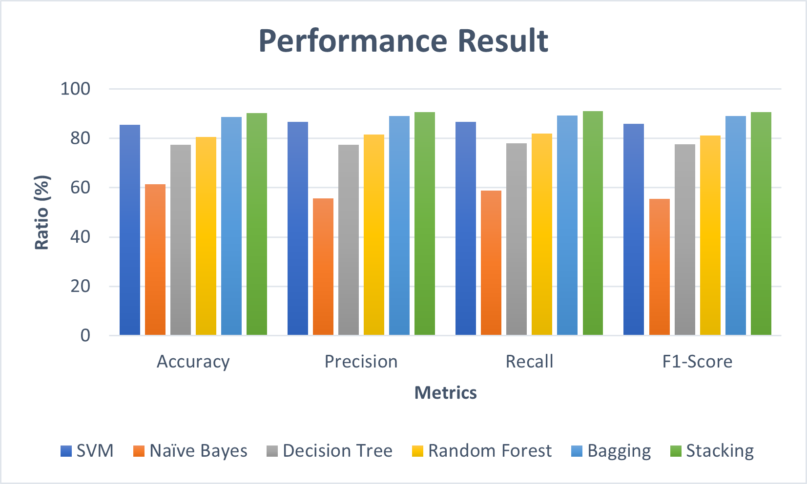

# Performance of Hybrid Stacking and Bagging Methods Based on Machine Learning Algorithms in the Classification of Dengue Fever Incidence Rate

## Project Overview
This project implements machine learning models to classify the Incidence Rate (IR) of Dengue Hemorrhagic Fever (DHF) in Bandung City, Indonesia. It compares single algorithms (SVM, Naive Bayes, Decision Tree, Random Forest) against Hybrid Ensemble methods (Stacking and Bagging) to improve classification accuracy. The study focuses on data from 2017 to 2021, addressing the increasing trend of dengue fever cases in the region.

## Dataset
The dataset integrates data from multiple sources:
1. **DHF Cases**: Bandung City Health Sevice
2. **Weather Data**: Bandung Meteorology, Climatology, and Geophysics Agency (BMKG)
3. **Demographies**: Bandung City Central Statistic Agency.

### Features
The dataset contains 13 attributes and 1 output class:
- Demographics: Total Population, Proportion of Male Population.
- Blood Types: Total count of Blood Types A, B, AB, and O.
- Weather: Rainfall, Temperature, Humidity.
- Education: Number of graduates (Elementary, Middle School, High School, College).

### Target Classes
The Incidence Rate (IR) is calculated per 100,000 population and classified into three labels:

- 0 (Low): IR < 55
- 1 (Medium): 55 $\le$ IR $\le$ 100
- 2 (High): IR > 100

## Methodology
The project follows a structured machine learning pipeline:
1. **Preprocessing**:
- Imbalance Handling: The dataset is imbalanced. Synthetic Minority Over-sampling Technique (SMOTE) is used to balance the classes.
- Normalization: Min-Max Normalization is applied to scale features between 0 and 1.
- Data Split: 80% Training, 20% Testing.

2. **Base Classifieer**:
- Support Vector Machine (SVM) (RBF Kernel).
- Naive Bayes (Gaussian).
- Decision Tree (Entropy/Gini).
- Random Forest.

3. **Hybrid Methods**:
- Bagging: Uses Bootstrap Aggregating with Random Forest as the base estimator to reduce variance.
- Stacking: Combines predictions from base learners (SVM, NB, DT, RF) and uses a Meta-Learner (Linear Regression) to make the final prediction.

## Results
The experiments demonstrate that hybrid methods outperform single algorithms. The Hybrid Stacking method achieved the highest performance across all metrics.

| Classifier | Accuracy | Precision | Recall | F1-Score |
| :--- | :--- | :--- | :--- | :--- |
| **Naïve Bayes** | 61.30% | 55.71% | 58.72% | 55.43% |
| **Decision Tree** | 77.40% | 77.36% | 78.00% | 77.64% |
| **Random Forest** | 80.60% | 81.48% | 81.87% | 81.09% |
| **SVM** | 85.50% | 86.76% | 86.77% | 85.82% |
| **Bagging (Hybrid)** | **88.70%** | **88.99%** | **89.18%** | **89.05%** |
| **Stacking (Hybrid)** | **90.30%** | **90.62%** | **90.94%** | **90.65%** |



## Installation & Usage
1. **Clone the repository:**
   ```bash
   git clone [https://github.com/citakamaliaa/dengue-fever-classification.git](https://github.com/citakamaliaa/dengue-fever-classification.git)
   cd citakamaliaa/dengue-fever-classification

2. **Install dependencies**
pip install numpy pandas scikit-learn matplotlib seaborn imbalanced-learn tensorflow

3. Run the Notebook: Open Dengue_Fever_IR_Classification.ipynb in Jupyter Notebook or Google Colab to reproduce the experiments.

## Publication
**Performance of Hybrid Stacking and Bagging Methods Based on Machine Learning Algorithms in the Classification of Dengue Fever Incidence Rate**

[](https://ieeexplore.ieee.org/document/10428704)

### Citation
If you find this repository useful, please consider citing our paper:

```bibtex
@inproceedings{citakamalia2025performance,
  title={Performance of Hybrid Stacking and Bagging Methods Based on Machine Learning Algorithms in the Classification of Dengue Fever Incidence Rate},
  author={Citakamalia and Prasetiyowati, Sri Suryani and Sibaroni, Yuliant},
  booktitle={2025 International Conference on [INSERT_CONFERENCE_NAME_HERE]},
  year={2025},
  organization={IEEE}
}
```

Disclaimer: The accuracy results in the notebook may vary slightly due to random state initialization and library versions compared to the final published paper results.

   
